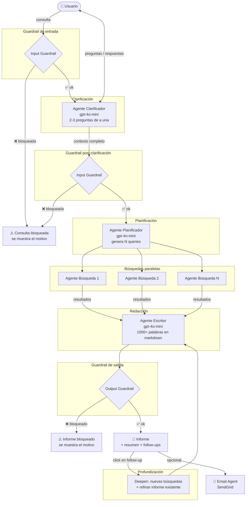

# Deep Research JP

Agente de investigación profunda construido sobre el [OpenAI Agents SDK](https://openai.github.io/openai-agents-python/).
Toma una consulta del usuario, la clarifica, investiga en paralelo en la web, genera un informe detallado en markdown y permite profundizar iterativamente sobre cualquier aspecto del resultado.

---

## Cómo está construido

### Archivos

| Archivo | Rol |
|---|---|
| `deep_research.py` | UI en Gradio + máquina de estados de la conversación |
| `research_manager.py` | Orquestador: coordina todos los agentes y produce eventos de progreso |
| `clarifier_agent.py` | Hace 2-3 preguntas antes de investigar para entender el contexto |
| `planner_agent.py` | Convierte la consulta en N queries de búsqueda web |
| `search_agent.py` | Ejecuta una búsqueda y devuelve un resumen conciso |
| `writer_agent.py` | Sintetiza los resultados en un informe markdown estructurado |
| `email_agent.py` | Envía el informe por email vía SendGrid (opcional) |
| `guardrails.py` | Guardrails de seguridad: bloquea consultas e informes problemáticos |

### Stack

- **OpenAI Agents SDK** — orquestación de agentes, tracing, guardrails
- **Gradio** — interfaz web
- **SendGrid** — envío de email
- **gpt-4o-mini** — modelo base para todos los agentes

---

## Flujo del agente



---

## Cómo usarlo

### Requisitos

Variables de entorno en `.env` (en la raíz del repo):

```env
OPENAI_API_KEY=sk-...
OPENAI_TRACING_API_KEY=sk-...   # opcional, para ver trazas en platform.openai.com
SENDGRID_API_KEY=SG....          # opcional, solo si usás el email
SENDER_VERIFIED_EMAIL=tu@email.com
TO_EMAIL=destino@email.com
```

### Instalación y ejecución

```bash
cd 2_openai/deep_research_jp
uv run deep_research.py
```

Se abre automáticamente en `http://127.0.0.1:7860`.

### Panel de opciones

Antes de iniciar una búsqueda podés configurar dos parámetros desde la barra fija en la parte superior:

| Opción | Valores | Default | Notas |
|---|---|---|---|
| **Motor de búsqueda** | DuckDuckGo / OpenAI WebSearch / Tavily | DuckDuckGo | DuckDuckGo es gratuito. OpenAI WebSearch consume créditos de la API. Tavily requiere `TAVILY_API_KEY` en el `.env`. |
| **Número de búsquedas** | 1 – 10 | 3 | Más búsquedas = informe más completo pero más lento y costoso. |

### Flujo de uso

1. **Configurás** motor de búsqueda y cantidad de búsquedas en la barra superior
2. **Escribís tu consulta** → el sistema te hace 2-3 preguntas de a una para entender el contexto
3. **Respondés cada pregunta** → arranca la investigación (podés ver el progreso en tiempo real en el chat)
4. **El informe aparece** en la columna derecha en formato markdown
5. **Podés profundizar**: hacé click en una de las preguntas de seguimiento → se auto-completa el input → enviás → el informe se expande con nueva investigación
6. **Email opcional**: una vez generado el informe, el botón "Enviar informe por email" aparece en la columna derecha

### Tracing

Cada investigación genera una URL de traza visible en el chat:
```
https://platform.openai.com/traces/trace?trace_id=...
```

---

## Qué se agregó respecto al original

El proyecto original (`deep_research/`) era un prototipo básico:

```
UI simple → plan (3 queries) → búsquedas → writer → email automático
```

### Cambios funcionales

| Feature | Original | JP |
|---|---|---|
| Clarificación previa | ❌ | ✅ 2-3 preguntas de a una |
| Guardrails de seguridad | ❌ | ✅ input (×2: antes y después de clarificar) + output |
| Profundización iterativa | ❌ | ✅ follow-ups clickeables → deepen |
| Follow-up questions visibles | ❌ (se generaban pero se perdían) | ✅ radio buttons |
| Email | Automático siempre | Botón post-reporte, opcional |
| Errores de email visibles | ❌ silenciosos | ✅ aparecen en el chat |
| Progreso visible | ❌ | ✅ cada paso en el chat |
| Motor de búsqueda | Fijo en código (`WebSearchTool`) | ✅ Seleccionable: DuckDuckGo / OpenAI / Tavily |
| Cantidad de búsquedas | Fijo en 3 | ✅ Slider 1–10 |

### Cambios de UI

| Elemento | Original | JP |
|---|---|---|
| Layout | Una columna | Dos columnas (chat \| informe) |
| Interfaz | Textbox + botón | Chat conversacional con estado |
| Estado | Sin estado | Máquina de estados: `idle → clarifying → researching → done → deepening` |
| Scroll | Página entera | Solo los componentes internos — input y opciones siempre visibles |
| Panel de opciones | ❌ | ✅ Barra fija superior con motor y cantidad de búsquedas |

### Nuevos archivos

- `clarifier_agent.py` — agente clarificador con output estructurado
- `guardrails.py` — dos guardrails LLM-based (input safety + output safety)
- `search_tools.py` — implementaciones de DuckDuckGo, OpenAI WebSearch y Tavily
